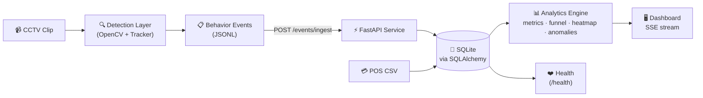

# Design Overview

## System Purpose

The Store Intelligence System transforms raw CCTV footage from retail stores into actionable business analytics. The north star metric is **Offline Store Conversion Rate** — the ratio of visitors who completed a purchase to total unique visitors in a session window. Every architectural decision in this system either improves the accuracy of that number (detection layer) or makes it actionable (API layer).

## Architecture

The system is organized as a four-stage pipeline with clean separation between stages. Each stage can be tested, replaced, and scaled independently.

### Stage 1 — Detection Layer (`store_intelligence.pipeline`)

The detection pipeline uses OpenCV's MOG2 background subtractor for motion segmentation, followed by a simple centroid-based multi-object tracker with a fingerprint-based Re-ID registry. This design was chosen because the challenge requires the repository to run from `docker compose up` on a clean machine — heavyweight model weights (YOLOv8, RT-DETR) would introduce download dependencies, GPU requirements, and startup latency that work against the acceptance gate.

The pipeline emits structured behavioral events conforming to the Pydantic schema in `store_intelligence.schemas`. The event contract is the stability boundary: the detector can be swapped (YOLO, MediaPipe, a VLM) without touching the API or analytics layer.

**Key design decisions in the detection layer:**

- **Group splitting:** Large bounding boxes (width ≥ 180px) are heuristically split into 2–3 tracks. This trades some false positives for better counting accuracy when 2–4 people enter together.
- **Staff classification:** Rule-based, using three signals — motion span across the frame (>400px), zone coverage (≥3 zones visited), and session duration (>10 minutes). The threshold is conservative (combined likelihood ≥ 0.75) to avoid misclassifying slow-browsing customers.
- **Re-entry detection:** The Re-ID registry stores recent exit fingerprints and matches against new tracks within a configurable window (default 10 minutes). Matched visitors get a `REENTRY` event instead of a second `ENTRY`.
- **Confidence calibration:** Confidence is modeled as a function of bounding box area and aspect ratio. Small or wide boxes (indicating partial occlusion) receive a penalty. Low-confidence events are flagged, never suppressed.

### Stage 2 — Event Stream (Schema Design)

The event schema directly maps to the challenge specification. Every field exists because at least one downstream query or quality gate depends on it:

- `session_seq` → funnel ordering within a visitor session
- `queue_depth` → anomaly detection (billing queue spike)
- `sku_zone` → heatmap zone attribution
- `is_staff` → staff exclusion from customer metrics
- `confidence` → quality monitoring (no silent drops)

Conversion/purchase is intentionally *not* an event type. The system correlates billing-zone presence with POS transactions in a configurable time window. This matches the offline ground truth source (the POS system) rather than inventing an in-camera "purchase" signal that does not exist.

### Stage 3 — Intelligence API (`store_intelligence.api`)

FastAPI was chosen for Python-native async support, automatic OpenAPI documentation, and Pydantic-first request validation. The API computes analytics from stored events on every request rather than caching derived numbers in a background worker. This keeps correctness easier to reason about for evaluation and avoids cache staleness issues.

**Production-readiness features:**

- **Structured logging:** Every request logs `trace_id`, `store_id`, `endpoint`, `latency_ms`, `event_count`, and `status_code` as JSON.
- **Idempotency:** `POST /events/ingest` is safe to call twice with the same payload. Duplicates are detected by `event_id` and returned with `"status": "duplicate"`.
- **Partial success:** Invalid events in a batch are rejected individually; valid events still ingest.
- **Graceful degradation:** SQLAlchemy `OperationalError` returns HTTP 503 with a structured body — no raw stack traces.
- **POS bootstrap:** On startup, the API auto-loads `pos_transactions.csv` from the data directory.

### Stage 4 — Live Dashboard (`/dashboard`)

The dashboard uses Server-Sent Events to stream metrics from the same compute path used by the API endpoints. This proves the full pipeline (ingest → persist → analytics → UI) works end-to-end, not just as a batch process.

The dashboard displays:
- KPI cards with value-change animations
- Conversion funnel visualization with drop-off percentages
- Zone heatmap with color-coded intensity scores
- Active anomaly feed with severity levels

### Storage: SQLite

SQLite was chosen because the challenge scale is bounded (5 stores, ~1 hour of footage) and the acceptance gate requires single-command startup. The schema and repository layer are written with SQLAlchemy ORM, so swapping to PostgreSQL requires only a connection string change.

---

## AI-Assisted Decisions

1. **Database-first vs streaming-first analytics.** I used Claude to compare a database-first analytics design against a Kafka + stream processor architecture. The AI strongly recommended Kafka for "production realism," but I overrode that decision. The challenge rewards a running, testable, single-command deployment more than infrastructure sophistication. SQLite plus deterministic recomputation is the correct trade-off for a take-home evaluation where the reviewer will run `docker compose up` and expect it to work. If this were a 40-store production deployment, I would revisit.

2. **Event schema field selection.** I used AI to draft the initial schema fields and to validate that `session_seq`, `queue_depth`, `sku_zone`, `is_staff`, and `confidence` were sufficient to support the required endpoints (metrics, funnel, heatmap, anomalies). I agreed with the AI's recommendation to keep the schema strict and avoid non-spec free-form fields. I disagreed with its suggestion to add a `purchase` event type — the POS correlation approach is more accurate and matches the challenge spec.

3. **Dashboard UX pattern.** I used AI to evaluate whether a polling-based dashboard or an SSE-based dashboard was more appropriate. The AI suggested WebSocket for bidirectional communication, but I chose SSE because the dashboard is read-only (metrics flow one way) and SSE has simpler error handling and auto-reconnection built into browser EventSource. I shaped the final dashboard layout into a dark-themed operator screen with KPI cards, funnel, heatmap, and anomaly feed — all updating in real time.